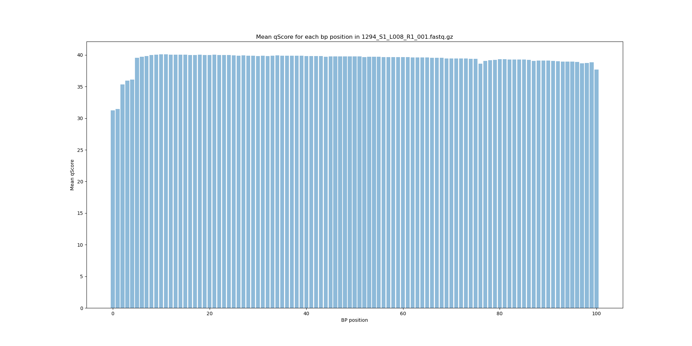
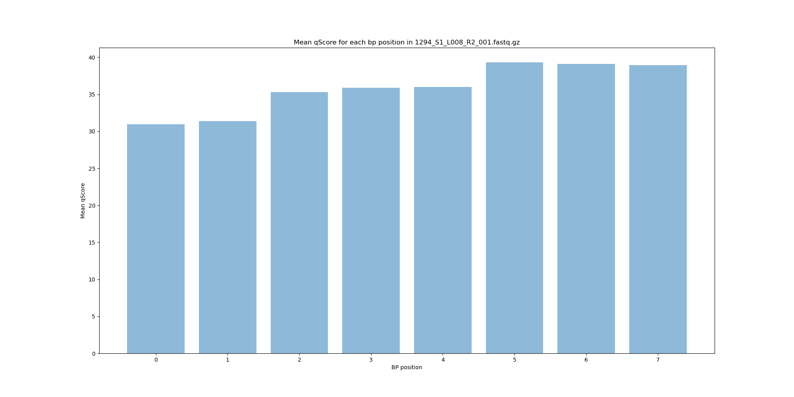
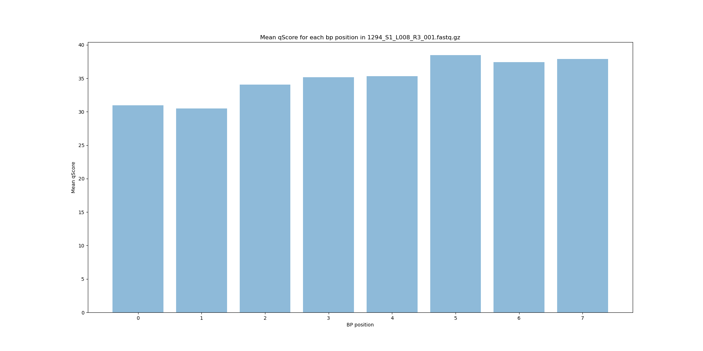
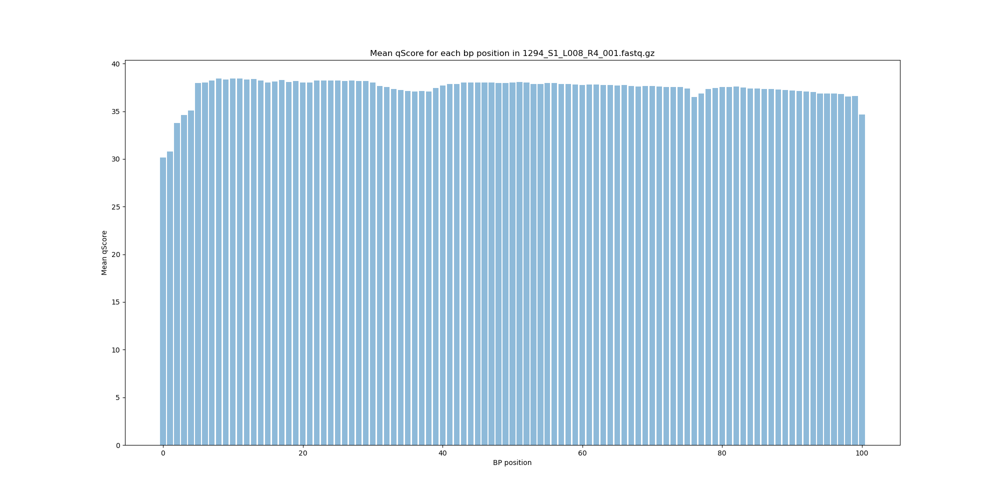

# Assignment the First

## Part 1
1. Be sure to upload your Python script.

| File name | label |
|---|---|
| 1294_S1_L008_R1_001.fastq.gz | Read 1 |
| 1294_S1_L008_R2_001.fastq.gz | Index 1 |
| 1294_S1_L008_R3_001.fastq.gz | Index 2 |
| 1294_S1_L008_R4_001.fastq.gz | Read 2 |

2. Per-base NT distribution
    1. Use markdown to insert your 4 histograms here.
    
    
    
    
    2. ```30 seems like a good cutoff, as all of the means are above 30 and this retains a good qscore so we know that the read is legible.```
    3. 
    ```
    zcat 1294_S1_L008_R[2,3]_001.fastq.gz |sed -n '2~4p' | awk '$0 ~ /N/ {sum+=1} END{print sum}' 
    7304664
    ```
    
## Part 2
1. Define the problem
We have 4 reads from the illumina sequencer flow cell run. R1, R2, R3, R4. You need to combine the index and the read, so that way we can see where the read came from. As the index were assigned before amplification and sequencing. They should be able to give us more information. 
2. Describe output
We have to put these reads into their index associated bins. There will be a forward read file, and a reverse comp read file. If there is ine swapping we will put those reads into their own bucket/files. If the read qualitys do not meet our quality score cutoff then they will be put into a trash bucket. 
3. Upload your [4 input FASTQ files](../TEST-input_FASTQ) and your [>=6 expected output FASTQ files](../TEST-output_FASTQ).
4. Pseudocode
5. High level functions. For each function, be sure to include:
    1. Description/doc string
    2. Function headers (name and parameters)
    3. Test examples for individual functions
    4. Return statement
